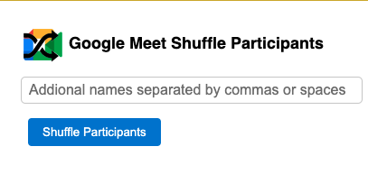

# Google Meet Shuffle Participants Extension

Google Meet Shuffle Participants is a Chrome extension that allows you to shuffle the list of participants in a Google Meet session. Add additional names and easily create a randomized list to keep track of participant order.



## Features

- Shuffle Google Meet participants
- Add custom names to the list
- Copy the shuffled list to clipboard

## Installation

1. Clone the repository:

```
git clone https://github.com/mikecamara/google-meet-shuffle-participants.git
```

2. Open Google Chrome and navigate to `chrome://extensions/`.

3. Enable "Developer mode" by toggling the switch in the top right corner.

4. Click "Load unpacked" and select the `google-meet-shuffle-participants` folder where you cloned the repository.

5. The extension is now installed and ready to use!


## Customizing Extension User's Name

To replace the "You" label with your own name in the participant list, follow these steps:

1. Open the `content.js` file in the `google-meet-shuffle-participants` folder.

2. Locate the following lines:

```javascript
/**
 * The constant username for the extension user.
 * @type {string}
 */
const extensionUserName = "Mike Camara";
```

Replace "Mike Camara" with your own name:

```
const extensionUserName = "Your Name";
```

## Usage

1. Join a Google Meet session.

2. Click on the Google Meet Shuffle Participants extension icon in the top right corner of the Chrome browser.

3. If desired, add additional names in the input field separated by commas or spaces.

4. Click the "Shuffle Participants" button to randomize the list.

5. The shuffled list will appear in the extension popup. Click the "Copy List" button to copy the names to your clipboard.

## Contributing

We welcome contributions to the project! Please follow these steps to contribute:

1. Fork the repository.

2. Create a new branch for your feature or bug fix.

3. Commit your changes and push to your fork.

4. Open a pull request with a clear description of your changes.

5. The extension is now installed and ready to use!


## License

This project is released under the [MIT License](./LICENSE).
